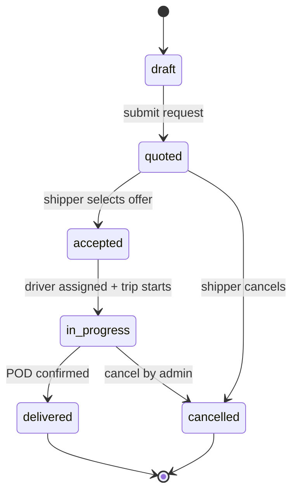
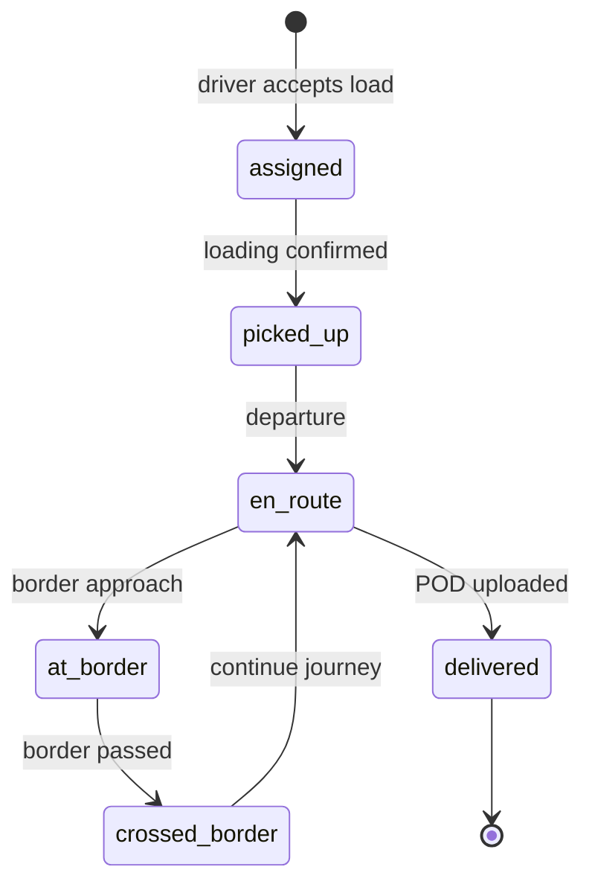

# 9. سفر کاربر (User Journey)

[← بازگشت به فهرست](./README.md)

---

## 9.1 سفر مشتری

```
[ورود از کانال: سایت / شبکه اجتماعی / معرفی / نمایشگاه / AI چت]
   ↓
[ثبت خودکار Lead در CRM — هیچ مشتری گم نمی‌شود]
   ↓
[صفحه اصلی: جستجوی سریع مسیر / یا چت با AI]
   ↓
[AI: جمع‌آوری اطلاعات + نمایش فوری نرخ از SRM]
   ↓
[مشاهده کاتالوگ محصولات /products]
   ├─ محصول موجود → پیش‌فاکتور فوری
   └─ محصول ناموجود → درخواست سفارش تولید → پیش‌فاکتور با جزئیات (زمان، هزینه، پیش‌پرداخت)
   ↓
[انتخاب مسیر: مثلاً چین → ایران]
   ↓
[مشاهده صفحه مسیر: نقشه + اطلاعات + نرخ‌های زنده از Providerها]
   ↓
[مقایسه: قیمت / زمان / امتیاز — بدون انتظار برای اپراتور]
   ↓
[AI: تولید پیش‌فاکتور PDF]
   ↓
[Handoff به اپراتور: خلاصه مکالمه + پیش‌فاکتور]
   ↓
[اپراتور: تایید/مذاکره/بستن قرارداد]
   ↓
[Provider تایید می‌کند]
   ↓
[مشاهده وضعیت لحظه‌ای + ردیابی راننده]
   ↓
[تحویل بار + ثبت امتیاز]
```

---

## 9.2 سفر Provider (SRM)

```
[ثبت‌نام + آپلود مدارک]
   ↓
[تایید توسط ادمین (SRM Onboarding)]
   ↓
[ورود به پنل SRM]
   ↓
[تعریف تابلو نرخ: مسیر × وزن × نوع بار × قیمت — خودخدمتی، بدون اپراتور]
   ↓
[نرخ‌ها فوری در سایت نمایش داده می‌شوند]
   ↓
[دریافت نوتیفیکیشن: "درخواست جدید در مسیر شما"]
   ↓
[مشاهده جزئیات درخواست]
   ↓
[ثبت پیشنهاد (اختیاری: قیمت متفاوت از تابلو)]
   ↓
[مشتری پیشنهاد را قبول می‌کند]
   ↓
[تخصیص راننده]
   ↓
[پیگیری سفر + دریافت پرداخت]
```

---

## 9.3 سفر اپراتور (CRM)

```
[Notification: Lead جدید / Handoff از AI]
   ↓
[مشاهده Lead در Pipeline + خلاصه مکالمه AI]
   ↓
[بررسی پیش‌فاکتور تولیدشده توسط AI]
   ↓
[تایید / اصلاح / مذاکره با مشتری]
   ↓
[بستن قرارداد]
   ↓
[پیگیری اجرا + تخصیص Provider/راننده]
   ↓
[Lead → Won در CRM]
```

---

## 9.5 سفر مشتری — پیش‌فاکتور اختصاصی (ادمین)

```
[ادمین محصول اختصاصی برای مشتری ثبت می‌کند]
   ↓
[ادمین پیش‌فاکتور صادر می‌کند]
   ↓
[سیستم لینک اختصاصی تولید می‌کند]
   ↓
[ارسال لینک به مشتری — SMS/ایمیل]
   ↓
[مشتری: /proforma/abc123 — فقط پیش‌فاکتور را می‌بیند]
   ↓
[مشتری: تایید / پرداخت / تماس]
```

---

## 9.6 سفر راننده

```
[نصب اپ + ثبت‌نام + آپلود مدارک]
   ↓
[تایید ادمین]
   ↓
[فعال‌سازی GPS]
   ↓
[مشاهده بارهای موجود در منطقه]
   ↓
[قبول یک بار]
   ↓
[مراجعه به مبدا + بارگیری + ثبت عکس]
   ↓
[حرکت + ارسال خودکار موقعیت]
   ↓
[رسیدن به مرز + ثبت رویداد]
   ↓
[عبور از مرز + ثبت رویداد]
   ↓
[رسیدن به مقصد + تحویل + ثبت POD]
   ↓
[پیشنهاد بار برگشت از مقصد]
   ↓
[قبول بار برگشت یا پایان سفر]
```

---

## جزئیات پیاده‌سازی

### State Machine — ShipmentRequest



### State Machine — Trip



### Conversion Funnel (مشتری)

| مرحله | Event | هدف تبدیل |
|-------|-------|-----------|
| 1. بازدید | `page_view` | — |
| 2. جستجوی نرخ | `rate_search` | 40% |
| 3. مشاهده نتایج | `rate_results_viewed` | 60% |
| 4. ثبت‌نام | `user_registered` | 30% |
| 5. ثبت درخواست | `request_created` | 50% |
| 6. انتخاب Provider | `provider_selected` | 70% |
| 7. تحویل | `shipment_delivered` | 90% |

### Notification Timeline

#### مشتری
| زمان | نوتیفیکیشن | کانال |
|------|-----------|-------|
| T+0 | درخواست ثبت شد | SMS + In-App |
| T+5min | پیشنهاد جدید از Provider X | SMS + Email |
| T+accept | Provider تایید کرد | SMS + Email |
| T+assign | راننده تخصیص یافت | In-App |
| T+pickup | بارگیری انجام شد | In-App |
| T+deliver | بار تحویل داده شد | SMS + Email |

#### Provider
| زمان | نوتیفیکیشن | کانال |
|------|-----------|-------|
| T+0 | درخواست جدید در مسیر شما | SMS + Email + In-App |
| T+accept | مشتری پیشنهاد شما را قبول کرد | SMS + In-App |
| T+trip | راننده بار را تحویل داد | In-App |

#### راننده
| زمان | نوتیفیکیشن | کانال |
|------|-----------|-------|
| T+0 | بار جدید در منطقه شما | Push |
| T+accept | بار شما تایید شد | Push |
| T+deliver | سفر تکمیل شد — بار برگشت موجود | Push |

### Screen Flow — مشتری (Web)

```
/ (Home)
  └─ RateSearchForm
       └─ /routes/:slug (Route Page)
            └─ RateResultsList
                 └─ [Login Required]
                      └─ /dashboard/new-request
                           └─ ProviderComparisonTable
                                └─ /dashboard/requests/:id
                                     └─ TrackingMap (live)
```

### Screen Flow — Provider (Web)

```
/provider/dashboard
  ├─ /provider/rate-board (CRUD rates)
  ├─ /provider/requests (incoming)
  │    └─ /provider/requests/:id (detail + offer)
  ├─ /provider/trips (active)
  │    └─ /provider/trips/:id (tracking)
  └─ /provider/analytics
```

### Screen Flow — راننده (App)

```
Splash → Auth → Home (Loads)
  ├─ LoadDetail → Accept → ActiveTrip
  │    ├─ Events (loading, border, delivery)
  │    ├─ Documents (POD upload)
  │    └─ Navigation
  └─ BackhaulLoads (after delivery)
```

### Edge Cases

| سناریو | رفتار سیستم |
|--------|------------|
| نرخ منقضی شده | نمایش "نرخ منقضی — درخواست به‌روزرسانی" |
| Provider پاسخ نداد | بعد از ۲۴ ساعت: یادآور + پیشنهاد Provider دیگر |
| راننده GPS قطع کرد | نمایش آخرین موقعیت + هشدار به Provider |
| مشتری بدون ثبت‌نام | مشاهده نرخ ✅، ثبت درخواست → redirect به login |
| بار برگشت موجود نیست | نمایش "فعلاً باری موجود نیست" + notification later |

### UX Metrics per Journey Step

| مرحله | Metric | هدف |
|-------|--------|-----|
| جستجوی نرخ | Time to first result | < 3 sec |
| ثبت درخواست | Form completion rate | > 70% |
| انتخاب Provider | Comparison table usage | > 50% |
| ردیابی | Map load time | < 2 sec |
| اپ راننده | Onboarding completion | > 80% |
