# L1. ۱۹ فرایند بارگیری و حمل (Shipment Loading Processes)

[← فهرست لجستیک](./README.md) | [← فهرست اصلی](../README.md)

---

## L1.1 هدف

در عملیات **بارگیری و حمل بین‌المللی**، SADRA دارای **۱۹ فرایند استاندارد** است که باید:

- در **Timeline** هر سفارش/سفر نمایش داده شود
- برای **ادمین**، **مشتری (Shipper)** و **راننده** قابل مشاهده باشد
- برای **Provider** نیز (بخش مرتبط) قابل مشاهده باشد
- هر فرایند: زمان ثبت، مسئول، موقعیت GPS (در صورت وجود)، عکس/مدرک

> این فرایندها جایگزین پیگیری تلفنی و کاغذی می‌شوند.

---

## L1.2 نمای کلی ۱۹ فرایند

```
 ┌─── پیش از حمل ───┐  ┌─── بارگیری ───┐  ┌─── حمل ───┐  ┌─── تحویل ───┐
 │ 01 → 02 → 03 → 04 │→│ 07→08→09→10→11 │→│12→13→14→15│→│16→17→18→19│
 │ 05 → 06            │  │                │  │  →16→17  │  │            │
 └────────────────────┘  └────────────────┘  └──────────┘  └────────────┘
```

| # | کد | نام فارسی | نام انگلیسی | فاز |
|---|-----|-----------|-------------|-----|
| 1 | `order_registered` | ثبت سفارش | Order Registered | پیش از حمل |
| 2 | `order_confirmed` | تایید سفارش | Order Confirmed | پیش از حمل |
| 3 | `provider_assigned` | تخصیص شرکت حمل | Provider Assigned | پیش از حمل |
| 4 | `driver_assigned` | تخصیص راننده | Driver Assigned | پیش از حمل |
| 5 | `documents_prepared` | آماده‌سازی مدارک | Documents Prepared | پیش از حمل |
| 6 | `freight_quote_accepted` | تایید نرخ/پیش‌فاکتور حمل | Freight Quote Accepted | پیش از حمل |
| 7 | `en_route_to_origin` | حرکت به سمت مبدا | En Route to Origin | بارگیری |
| 8 | `arrived_at_origin` | رسیدن به مبدا بارگیری | Arrived at Origin | بارگیری |
| 9 | `loading_started` | شروع بارگیری | Loading Started | بارگیری |
| 10 | `loading_completed` | اتمام بارگیری | Loading Completed | بارگیری |
| 11 | `weighbridge_recorded` | ثبت توزین (باسکول) | Weighbridge Recorded | بارگیری |
| 12 | `bill_of_lading_issued` | صدور بارنامه (CMR) | Bill of Lading Issued | بارگیری |
| 13 | `departed_origin` | خروج از مبدا | Departed Origin | حمل |
| 14 | `in_transit` | در مسیر | In Transit | حمل |
| 15 | `arrived_at_border` | رسیدن به مرز | Arrived at Border | حمل |
| 16 | `customs_clearance` | ترخیص / بررسی گمرکی | Customs Clearance | حمل |
| 17 | `border_crossed` | عبور از مرز | Border Crossed | حمل |
| 18 | `arrived_at_destination` | رسیدن به مقصد | Arrived at Destination | تحویل |
| 19 | `unloaded_delivered` | تخلیه و تحویل (POD) | Unloaded & Delivered | تحویل |

---

## L1.3 جزئیات هر فرایند

### فاز ۱: پیش از حمل (فرایند ۱–۶)

| # | فرایند | توضیح | ثبت توسط | مدرک |
|---|--------|-------|----------|------|
| 1 | ثبت سفارش | مشتری درخواست حمل ثبت می‌کند | سیستم / مشتری | — |
| 2 | تایید سفارش | ادمین یا Provider سفارش را تایید | ادمین / Provider | — |
| 3 | تخصیص Provider | شرکت حمل انتخاب می‌شود | ادمین / سیستم | — |
| 4 | تخصیص راننده | راننده به سفر اختصاص می‌یابد | Provider / ادمین | — |
| 5 | آماده‌سازی مدارک | بارنامه، گمرک، بیمه | ادمین / Provider | PDF |
| 6 | تایید نرخ حمل | مشتری پیش‌فاکتور/نرخ را می‌پذیرد | مشتری / سیستم | پیش‌فاکتور |

### فاز ۲: بارگیری (فرایند ۷–۱۲)

| # | فرایند | توضیح | ثبت توسط | مدرک |
|---|--------|-------|----------|------|
| 7 | حرکت به مبدا | راننده به محل بارگیری می‌رود | راننده / GPS | موقعیت |
| 8 | رسیدن به مبدا | راننده به انبار/کارخانه رسید | راننده / GPS | موقعیت |
| 9 | شروع بارگیری | عملیات بارگیری شروع شد | راننده | عکس |
| 10 | اتمام بارگیری | بارگیری کامل شد | راننده | عکس |
| 11 | ثبت توزین | وزن در باسکول ثبت شد | راننده / ادمین | رسید توزین |
| 12 | صدور بارنامه | CMR / بارنامه بین‌المللی صادر شد | ادمین / Provider | PDF |

### فاز ۳: حمل (فرایند ۱۳–۱۷)

| # | فرایند | توضیح | ثبت توسط | مدرک |
|---|--------|-------|----------|------|
| 13 | خروج از مبدا | کامیون از مبدا خارج شد | راننده / GPS | موقعیت |
| 14 | در مسیر | حمل در جاده ادامه دارد | GPS خودکار | هر ۳۰ ثانیه |
| 15 | رسیدن به مرز | راننده به گیت مرز رسید | راننده / GPS | موقعیت |
| 16 | ترخیص گمرکی | بررسی و ترخیص در گمرک | ادمین / راننده | رسید گمرک |
| 17 | عبور از مرز | عبور موفق از مرز | راننده | عکس / مهر |

### فاز ۴: تحویل (فرایند ۱۸–۱۹)

| # | فرایند | توضیح | ثبت توسط | مدرک |
|---|--------|-------|----------|------|
| 18 | رسیدن به مقصد | راننده به آدرس تحویل رسید | راننده / GPS | موقعیت |
| 19 | تخلیه و تحویل | بار تخلیه + POD | راننده | POD + عکس + امضا |

---

## L1.4 ماتریس دسترسی — چه کسی چه می‌بیند؟

| فرایند | ادمین | مشتری | راننده | Provider |
|--------|-------|-------|--------|----------|
| مشاهده Timeline | ✅ همه | ✅ سفارش خود | ✅ سفر خود | ✅ سفارش مرتبط |
| ثبت/تایید فرایند | ✅ همه | ❌ | ✅ ۷–۱۹ | ✅ ۲,۳,۵,۱۲ |
| آپلود مدرک | ✅ | ❌ | ✅ | ✅ |
| ویرایش/برگشت | ✅ | ❌ | ❌ | ❌ |
| اعلان (Notification) | ✅ | ✅ | ✅ | ✅ |

### سطح جزئیات نمایش

| نقش | نمایش |
|-----|-------|
| **ادمین** | Timeline کامل + GPS زنده + مدارک + لاگ + امکان ثبت دستی |
| **مشتری** | Timeline ساده‌شده + ETA + موقعیت روی نقشه + مدارک تاییدشده |
| **راننده** | فرایند فعلی + دکمه «ثبت مرحله بعد» + آپلود عکس + ناوبری |
| **Provider** | Timeline سفارش‌های خود + تخصیص راننده + مدارک |

---

## L1.5 UI — Timeline مشترک

### نمای مشتری (`/dashboard/requests/:id/tracking`)

```
┌─────────────────────────────────────────────────────────┐
│  پیگیری سفارش #SH-2026-0842                             │
│  تهران → شانگهای | ۲۰ تن                                │
├─────────────────────────────────────────────────────────┤
│  ████████████░░░░░░░░  ۶۳٪ — در مسیر (فرایند ۱۴)        │
├─────────────────────────────────────────────────────────┤
│  ✅ 01 ثبت سفارش           ۱۴۰۵/۰۶/۰۱  ۱۰:۳۰            │
│  ✅ 02 تایید سفارش         ۱۴۰۵/۰۶/۰۱  ۱۱:۰۰            │
│  ✅ 03 تخصیص Provider      ۱۴۰۵/۰۶/۰۱  ۱۴:۰۰            │
│  ✅ 04 تخصیص راننده        ۱۴۰۵/۰۶/۰۲  ۰۹:۰۰            │
│  ✅ 09 شروع بارگیری        ۱۴۰۵/۰۶/۰۳  ۰۸:۳۰  📷        │
│  ✅ 10 اتمام بارگیری       ۱۴۰۵/۰۶/۰۳  ۱۲:۰۰  📷        │
│  ✅ 13 خروج از مبدا        ۱۴۰۵/۰۶/۰۳  ۱۳:۰۰            │
│  🔵 14 در مسیر             — الان — 📍 نقشه زنده       │
│  ⬜ 15 رسیدن به مرز                                      │
│  ⬜ ...                                                  │
│  ⬜ 19 تحویل                                             │
├─────────────────────────────────────────────────────────┤
│  [نقشه زنده موقعیت راننده]                              │
└─────────────────────────────────────────────────────────┘
```

### نمای راننده (اپ — صفحه سفر فعال)

```
┌─────────────────────────────────────────────────────────┐
│  سفر فعال — تهران به مشهد                               │
│  مرحله فعلی: 14 — در مسیر                               │
├─────────────────────────────────────────────────────────┤
│  [ثبت مرحله بعد: رسیدن به مرز]  ← دکمه اصلی             │
│  [آپلود عکس/مدرک]                                       │
│  [تماس با Provider]                                     │
├─────────────────────────────────────────────────────────┤
│  Timeline (خلاصه):                                       │
│  ✅ بارگیری → ✅ خروج → 🔵 در مسیر → ⬜ مرز → ⬜ تحویل   │
└─────────────────────────────────────────────────────────┘
```

### نمای ادمین (`/admin/trips/:id`)

```
┌─────────────────────────────────────────────────────────┐
│  مدیریت سفر — همه ۱۹ فرایند                             │
│  [ثبت دستی فرایند] [برگشت به مرحله قبل] [لغو سفر]       │
├─────────────────────────────────────────────────────────┤
│  جدول کامل: # | فرایند | زمان | ثبت‌کننده | GPS | مدرک  │
│  + نقشه + لاگ تغییرات                                   │
└─────────────────────────────────────────────────────────┘
```

---

## L1.6 State Machine

```mermaid
stateDiagram-v2
    direction LR
    [*] --> order_registered
    order_registered --> order_confirmed
    order_confirmed --> provider_assigned
    provider_assigned --> driver_assigned
    driver_assigned --> documents_prepared
    documents_prepared --> freight_quote_accepted
    freight_quote_accepted --> en_route_to_origin
    en_route_to_origin --> arrived_at_origin
    arrived_at_origin --> loading_started
    loading_started --> loading_completed
    loading_completed --> weighbridge_recorded
    weighbridge_recorded --> bill_of_lading_issued
    bill_of_lading_issued --> departed_origin
    departed_origin --> in_transit
    in_transit --> arrived_at_border
    arrived_at_border --> customs_clearance
    customs_clearance --> border_crossed
    border_crossed --> in_transit: ادامه مسیر
    in_transit --> arrived_at_destination
    arrived_at_destination --> unloaded_delivered
    unloaded_delivered --> [*]
```



**قوانین:**
- فرایندها به ترتیب شماره پیش می‌روند (جز `in_transit` که تکرارپذیر است)
- ادمین می‌تواند هر فرایند را دستی ثبت/اصلاح کند
- راننده فقط فرایندهای ۷–۱۹ را ثبت می‌کند
- پرش از مرحله بدون ثبت مرحله قبل → فقط ادمین

---

## L1.7 جزئیات پیاده‌سازی

### Database

```sql
CREATE TYPE shipment_process_code AS ENUM (
  'order_registered', 'order_confirmed', 'provider_assigned',
  'driver_assigned', 'documents_prepared', 'freight_quote_accepted',
  'en_route_to_origin', 'arrived_at_origin', 'loading_started',
  'loading_completed', 'weighbridge_recorded', 'bill_of_lading_issued',
  'departed_origin', 'in_transit', 'arrived_at_border',
  'customs_clearance', 'border_crossed', 'arrived_at_destination',
  'unloaded_delivered'
);

CREATE TYPE process_recorded_by AS ENUM (
  'system', 'admin', 'operator', 'provider', 'driver', 'shipper', 'gps_auto'
);

CREATE TABLE shipment_process_events (
  id UUID PRIMARY KEY DEFAULT gen_random_uuid(),
  shipment_request_id UUID NOT NULL REFERENCES shipment_requests(id),
  trip_id UUID REFERENCES trips(id),
  process_code shipment_process_code NOT NULL,
  process_number SMALLINT NOT NULL,  -- 1 تا 19
  title_fa VARCHAR(100) NOT NULL,
  title_en VARCHAR(100),
  status VARCHAR(20) DEFAULT 'completed',  -- pending | completed | skipped
  recorded_by process_recorded_by NOT NULL,
  recorded_by_user_id UUID REFERENCES users(id),
  location GEOGRAPHY(POINT, 4326),
  notes TEXT,
  attachment_urls JSONB DEFAULT '[]',
  metadata JSONB DEFAULT '{}',  -- وزن، شماره بارنامه، ...
  occurred_at TIMESTAMPTZ NOT NULL DEFAULT NOW(),
  created_at TIMESTAMPTZ DEFAULT NOW()
);

CREATE INDEX idx_process_events_shipment
  ON shipment_process_events (shipment_request_id, process_number);
CREATE INDEX idx_process_events_trip
  ON shipment_process_events (trip_id, occurred_at DESC);

-- View: آخرین فرایند فعال هر سفارش
CREATE VIEW shipment_current_process AS
SELECT DISTINCT ON (shipment_request_id)
  shipment_request_id, process_code, process_number, occurred_at
FROM shipment_process_events
ORDER BY shipment_request_id, process_number DESC, occurred_at DESC;
```

### API Endpoints

| Method | Endpoint | Roles | توضیح |
|--------|----------|-------|-------|
| GET | `/v1/shipments/:id/processes` | admin, shipper, provider, driver | Timeline ۱۹ فرایند |
| GET | `/v1/shipments/:id/processes/current` | all roles | فرایند فعلی + درصد پیشرفت |
| POST | `/v1/shipments/:id/processes` | admin, driver, provider | ثبت فرایند جدید |
| PATCH | `/v1/shipments/:id/processes/:eventId` | admin | ویرایش / اصلاح |
| POST | `/v1/trips/:id/processes/next` | driver | ثبت مرحله بعد (هوشمند) |
| GET | `/v1/admin/shipments/processes/dashboard` | admin | آمار فرایندها |

### Response — Timeline

```typescript
interface ShipmentProcessTimeline {
  shipmentId: string;
  currentProcess: {
    code: ShipmentProcessCode;
    number: number;       // 1-19
    titleFa: string;
    progressPercent: number;  // number/19 * 100
  };
  events: Array<{
    code: ShipmentProcessCode;
    number: number;
    titleFa: string;
    status: 'completed' | 'pending' | 'current';
    occurredAt?: string;
    recordedBy: string;
    location?: { lat: number; lng: number };
    attachments?: string[];
  }>;
}
```

### Notification per Process

| فرایند | مشتری | راننده | Provider | ادمین |
|--------|-------|--------|----------|-------|
| 04 تخصیص راننده | SMS | Push | In-App | — |
| 09 شروع بارگیری | In-App | — | In-App | — |
| 12 صدور بارنامه | Email | — | In-App | — |
| 15 رسیدن به مرز | In-App | — | In-App | In-App |
| 17 عبور از مرز | In-App | — | — | — |
| 19 تحویل | SMS + Email | Push | In-App | In-App |

### Frontend Components

```tsx
// packages/ui/src/ShipmentProcessTimeline.tsx
// - Vertical timeline با ۱۹ مرحله
// - variant: 'full' | 'compact' (مشتری) | 'driver' (فقط فعلی + بعدی)
// - نقشه برای فرایندهای GPS-enabled (7,8,13,14,15,18)

// apps/driver-app/lib/features/trip/process_action_button.dart
// - دکمه «ثبت مرحله بعد» بر اساس process_number فعلی
```

### یکپارچگی با DRV-11

فرایندهای ۷–۱۹ مستقیماً با **DRV-11 (ثبت رویدادها)** در اپ راننده یکپارچه می‌شوند:

| DRV-11 Event | Process Code |
|--------------|--------------|
| بارگیری | `loading_started`, `loading_completed` |
| رسیدن به مرز | `arrived_at_border` |
| عبور از مرز | `border_crossed` |
| تحویل | `unloaded_delivered` |

---

## L1.8 Acceptance Criteria

- [ ] هر سفارش حمل Timeline ۱۹ مرحله‌ای داشته باشد
- [ ] مشتری در داشبورد خود Timeline را ببیند (فقط خواندنی)
- [ ] راننده در اپ مرحله فعلی + دکمه ثبت مرحله بعد را ببیند
- [ ] ادمین همه فرایندها را ببیند و بتواند دستی ثبت/ویرایش کند
- [ ] Provider Timeline سفارش‌های مرتبط را ببیند
- [ ] درصد پیشرفت (X از ۱۹) محاسبه و نمایش داده شود
- [ ] فرایندهای GPS (۷,۸,۱۳,۱۴,۱۵,۱۸) موقعیت ثبت کنند
- [ ] فرایندهای بارگیری (۹,۱۰,۱۹) امکان آپلود عکس داشته باشند
- [ ] نوتیفیکیشن در مراحل کلیدی ارسال شود
- [ ] فرایند ۱۹ (تحویل) سفارش را `delivered` کند

---

## L1.9 پیکربندی (اختیاری)

فرایندها در جدول `process_definitions` قابل تنظیم هستند (برای مسیرهای خاص مرز اضافه شود):

```sql
CREATE TABLE process_definitions (
  id UUID PRIMARY KEY,
  transport_mode transport_mode DEFAULT 'land',
  process_number SMALLINT,
  code shipment_process_code,
  title_fa VARCHAR(100),
  title_en VARCHAR(100),
  is_required BOOLEAN DEFAULT true,
  gps_required BOOLEAN DEFAULT false,
  photo_required BOOLEAN DEFAULT false,
  allowed_roles process_recorded_by[]
);
```

> برای MVP: ۱۹ فرایند ثابت (hardcoded seed). فاز ۲: پیکربندی per-route.
